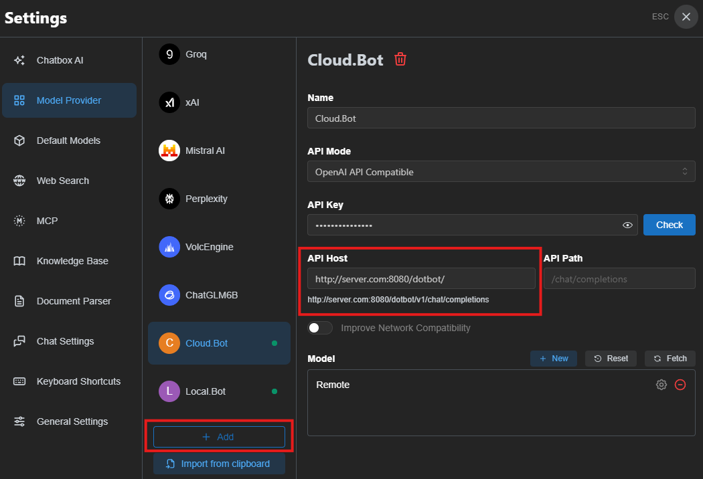

# DotBot API 模式指南

DotBot API 模式将 Agent 能力通过 **OpenAI 兼容的 HTTP API** 暴露，外部应用可直接使用标准 OpenAI SDK（Python、JavaScript、.NET 等）调用 DotBot 进行推理和工具调用，无需自定义 SDK。

## 快速开始

### 1. 配置

在 `appsettings.json` 中启用 API 模式：

```json
{
    "ApiKey": "sk-your-llm-api-key",
    "Model": "gpt-4o-mini",
    "EndPoint": "https://api.openai.com/v1",
    "Api": {
        "Enabled": true,
        "Host": "0.0.0.0",
        "Port": 8080,
        "ApiKey": "your-api-access-key",
        "AutoApprove": true
    }
}
```

### 2. 启动

```bash
cd /your/workspace
dotbot
```

启动成功后控制台输出：

```
DotBot API listening on http://0.0.0.0:8080
Endpoints (OpenAI-compatible):
  POST /dotbot/v1/chat/completions
Additional endpoints:
  GET  /v1/health
  GET  /v1/tools
  GET  /v1/sessions
  DELETE /v1/sessions/{id}
All tools enabled (9 tools)
Press Ctrl+C to stop...
```

### 3. 调用

使用任何 OpenAI 兼容的 SDK 即可调用：

**Python**

Python 示例代码可见 `Samples/python`.

```python
from openai import OpenAI

client = OpenAI(
    base_url="http://localhost:8080/dotbot/v1",
    api_key="your-api-access-key"
)

response = client.chat.completions.create(
    model="dotbot",
    messages=[
        {"role": "user", "content": "搜索最新的 AI 新闻"}
    ]
)

print(response.choices[0].message.content)
```

**Desktop Application**

DotBot 的 API 模式可以作为模型提供方，在流行的 AI 桌面应用（例如Chatbox）中聊天。



---

## 配置项

| 配置项 | 类型 | 默认值 | 说明 |
|--------|------|--------|------|
| `Api.Enabled` | bool | `false` | 是否启用 API 模式 |
| `Api.Host` | string | `"0.0.0.0"` | HTTP 服务监听地址 |
| `Api.Port` | int | `8080` | HTTP 服务监听端口 |
| `Api.ApiKey` | string | 空 | API 访问密钥（Bearer Token），为空时不验证 |
| `Api.AutoApprove` | bool | `true` | 是否自动批准所有文件/Shell 操作（被 ApprovalMode 覆盖） |
| `Api.ApprovalMode` | string | 空 | 审批模式：`auto`/`reject`/`interactive`，设置后覆盖 AutoApprove |
| `Api.ApprovalTimeoutSeconds` | int | `120` | interactive 模式下审批请求超时时间（秒） |
| `Api.EnabledTools` | array | `[]` | 启用的工具列表，为空时启用所有工具 |

---

## 认证

### Bearer Token 认证

当 `Api.ApiKey` 配置为非空值时，所有对 `/dotbot/` 路径的请求都需要携带 Bearer Token：

```
Authorization: Bearer your-api-access-key
```

未通过认证的请求会返回 `401 Unauthorized`。

辅助端点（`/v1/health`、`/v1/tools`、`/v1/sessions`）也需要认证（`/v1/health` 除外）。

### 禁用认证

将 `Api.ApiKey` 设置为空字符串或不设置，即可禁用认证。适用于本地开发或内网部署。

> **安全建议**：生产环境务必配置 `ApiKey`，避免未授权访问。

---

## 操作审批

API 模式通过 `ApiApprovalService` 处理操作审批，支持三种模式：

| 模式 | 配置 | 行为 |
|------|------|------|
| **auto** | `"ApprovalMode": "auto"` 或 `"AutoApprove": true` | 所有文件操作和 Shell 命令自动批准 |
| **reject** | `"ApprovalMode": "reject"` 或 `"AutoApprove": false` | 所有文件操作和 Shell 命令自动拒绝 |
| **interactive** | `"ApprovalMode": "interactive"` | Human-in-the-Loop：敏感操作暂停等待 API 客户端审批 |

> `ApprovalMode` 设置后会覆盖 `AutoApprove`。

### Human-in-the-Loop 交互式审批

当 `ApprovalMode` 设为 `"interactive"` 时，Agent 执行敏感操作（工作区外的文件访问、Shell 命令）会暂停并创建待审批请求，等待 API 客户端通过审批端点进行审批。

**流程**：

```
客户端发送聊天请求
    ↓
Agent 执行工具 → 遇到需审批操作 → 暂停
    ↓
客户端轮询 GET /v1/approvals → 获取待审批列表
    ↓
客户端发送 POST /v1/approvals/{id} → 批准/拒绝
    ↓
Agent 恢复执行 → 返回结果
```

**配置**：

```json
{
    "Api": {
        "Enabled": true,
        "ApprovalMode": "interactive",
        "ApprovalTimeoutSeconds": 120
    }
}
```

**审批端点**：

#### GET /v1/approvals

获取所有待审批请求。

```bash
curl -H "Authorization: Bearer your-key" http://localhost:8080/v1/approvals
```

响应：
```json
{
    "approvals": [
        {
            "id": "a1b2c3d4e5f6",
            "type": "file",
            "operation": "write",
            "detail": "/path/to/file.txt",
            "createdAt": "2025-01-01T00:00:00.0000000Z"
        }
    ]
}
```

#### POST /v1/approvals/{id}

批准或拒绝一个待审批请求。

```bash
# 批准
curl -X POST -H "Authorization: Bearer your-key" \
  -H "Content-Type: application/json" \
  -d '{"approved": true}' \
  http://localhost:8080/v1/approvals/a1b2c3d4e5f6

# 拒绝
curl -X POST -H "Authorization: Bearer your-key" \
  -H "Content-Type: application/json" \
  -d '{"approved": false}' \
  http://localhost:8080/v1/approvals/a1b2c3d4e5f6
```

**Python 示例**：

完整的 Human-in-the-Loop Python 示例见 [`Samples/python/human_in_the_loop.py`](../Samples/python/human_in_the_loop.py)。

> **超时**：如果在 `ApprovalTimeoutSeconds`（默认 120 秒）内未收到审批决定，操作会自动被拒绝。

> **安全建议**：如果 DotBot 部署在公网，建议使用 `"interactive"` 或 `"reject"` 模式，并仅启用安全的工具（如 `web_search`）。

---

## Python 示例

完整的 Python 使用示例见 [`Samples/python/`](../Samples/python/) 目录：

| 示例 | 说明 |
|------|------|
| [basic_chat.py](../Samples/python/basic_chat.py) | 基本对话（非流式） |
| [streaming_chat.py](../Samples/python/streaming_chat.py) | 流式输出 |
| [multi_turn_chat.py](../Samples/python/multi_turn_chat.py) | 多轮对话（交互式 REPL） |
| [human_in_the_loop.py](../Samples/python/human_in_the_loop.py) | Human-in-the-Loop 审批流程 |

---

## 相关文档

- [配置指南](./config_guide.md) - 完整配置项说明
- [QQ 机器人指南](./qq_bot_guide.md) - QQ 机器人模式
- [企业微信指南](./wecom_guide.md) - 企业微信机器人模式
- [文档索引](./index.md) - 完整文档导航
