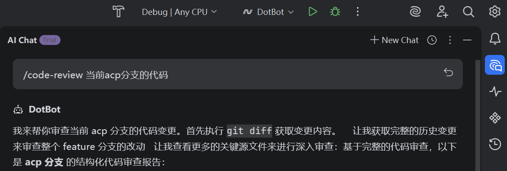
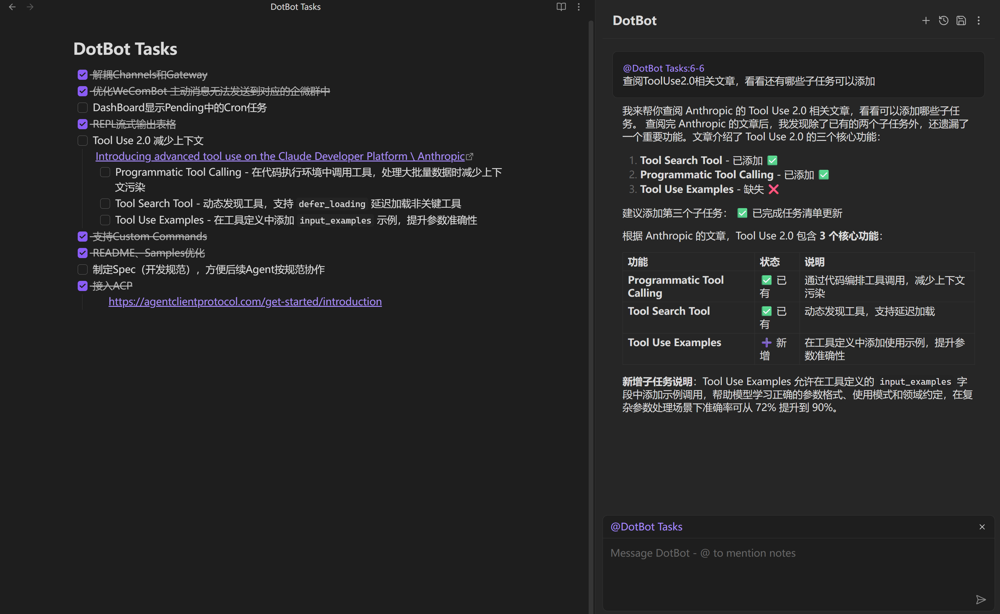

# DotBot ACP Mode Guide

[Agent Client Protocol (ACP)](https://agentclientprotocol.com/) is an open protocol that standardizes how coding agents communicate with editors and IDEs — the same idea as LSP, but for AI agents. Any editor that implements ACP can host any ACP-compatible agent. DotBot speaks ACP natively, which means it can run as a first-class coding assistant inside your editor without requiring a cloud subscription, a proprietary plugin, or any vendor-specific setup.

Communication happens over **stdio (standard input/output) using JSON-RPC 2.0**: the editor launches DotBot as a subprocess and exchanges messages through its standard streams. There is no network port, no authentication token to manage, and no data leaving your machine unless your configured LLM endpoint is remote.

## Supported Editors

ACP is an open standard and its ecosystem is growing. DotBot has been verified to work in:

| Editor | Plugin / Integration |
|--------|----------------------|
| **JetBrains Rider** (and other JetBrains IDEs) | Built-in AI Assistant agent support |
| **Obsidian** | [obsidian-agent-client](https://github.com/RAIT-09/obsidian-agent-client) |

Any other editor or tool with ACP support can integrate DotBot using the same configuration pattern.

## Quick Start

### 1. Initialize the DotBot workspace

Before connecting an editor, run DotBot once in the project directory from a terminal. This creates the `.bot/` folder with default configuration files and built-in commands:

```bash
cd <your-project-directory>
dotbot
```

DotBot will initialize the workspace and enter CLI mode. You can exit immediately — the workspace is ready. See the [Configuration Guide](./config_guide.md) for details on configuring the model and other options.

### 2. Configure ACP in your editor

In your editor's agent settings, set the **command** to `dotbot` and add `-acp` as an **argument**. DotBot automatically activates ACP mode when launched with the `-acp` flag — no changes to the config file are required.

The **working directory** should be set to the project root you initialized in step 1.

---

## JetBrains Rider (and JetBrains IDEs)

JetBrains IDEs with the AI Assistant plugin support ACP agents directly. Open **AIChat - Add Custom Agents** and add the following configuration:

```json
{
    "agent_servers": {
        "DotBot": {
            "command": "dotbot",
            "args": ["-acp"]
        }
    }
}
```

After saving, select DotBot from the agent picker in the AI chat panel. The IDE handles process lifecycle — DotBot starts when you open a session and stops when you close it.



---

## Obsidian

Install the [obsidian-agent-client](https://github.com/RAIT-09/obsidian-agent-client) plugin (via BRAT or manual installation), then open its settings and add a Custom agent:

| Field | Value |
|-------|-------|
| **AgentID** | DotBot |
| **Display name** | DotBot |
| **Path** | `dotbot.exe` |
| **Arguments** | `-acp` |

Once configured, DotBot appears as an agent in the plugin's chat interface. It can answer questions and read or write notes directly — the same agent that helps you code can also help you organize your knowledge base.



---

## How It Works

When the editor launches DotBot in ACP mode, the following sequence takes place:

1. **Initialization** — Both sides exchange protocol versions and capability declarations (`initialize`).
2. **Session creation** — The editor creates a new session (`session/new`); DotBot broadcasts available slash commands and config options to the editor UI.
3. **Prompt exchange** — The editor sends user messages (`session/prompt`); DotBot streams back replies, tool call statuses, and results via `session/update`.
4. **Permission requests** — Before executing file writes or shell commands, DotBot sends a `requestPermission` message; the editor surfaces an approve/reject prompt to the user.
5. **File and terminal access** — DotBot can read files through the editor (`fs/readTextFile`), write files with a diff preview (`fs/writeTextFile`), and create/manage terminals (`terminal/*`), all routed through the editor's own APIs.

This means DotBot can read unsaved buffer contents, show diffs inline before applying changes, and run commands in an editor-managed terminal — capabilities that go beyond what a plain CLI agent can offer.

## Supported Protocol Features

| Feature | Description |
|---------|-------------|
| `initialize` | Protocol version negotiation and capability exchange |
| `session/new` | Create a new session |
| `session/load` | Load an existing session and replay history |
| `session/list` | List all ACP sessions |
| `session/prompt` | Send a prompt and receive streaming replies |
| `session/update` | DotBot pushes message chunks and tool call status to the editor |
| `session/cancel` | Cancel an in-progress operation |
| `requestPermission` | DotBot requests execution permission for sensitive operations |
| `fs/readTextFile` | Read files through the editor, including unsaved changes |
| `fs/writeTextFile` | Write files through the editor with diff preview |
| `terminal/*` | Create and manage terminals through the editor |
| Slash Commands | Custom commands (from `.bot/commands/`) are broadcast to the editor UI |
| Config Options | Expose selectable configuration (mode, model, etc.) to the editor |

## Session & Workspace Behavior

ACP sessions follow the same isolation model as all other DotBot channels:

- **Session ID format**: `acp_{sessionId}` (the session ID is assigned by the editor and passed to DotBot)
- **Session storage**: stored in `<workspace>/.bot/sessions/` alongside sessions from other channels
- **Shared memory**: `memory/MEMORY.md` and `memory/HISTORY.md` are shared with all other channels running in the same workspace — knowledge DotBot acquires in an ACP session is accessible from CLI or QQ bot sessions in the same workspace, and vice versa

In [Gateway mode](./config_guide.md#gateway-multi-channel-concurrent-mode), ACP runs concurrently with QQ Bot, WeCom Bot, and the API service. All channels share the same HeartbeatService, CronService, and workspace.

## Further Reading

- [Configuration Guide — ACP Mode Configuration](./config_guide.md#acp-mode-configuration) — full config reference
- [ACP Protocol Specification](https://agentclientprotocol.com/get-started/introduction) — official protocol documentation
- [Gateway Mode](./config_guide.md#gateway-multi-channel-concurrent-mode) — run ACP alongside other channels concurrently
