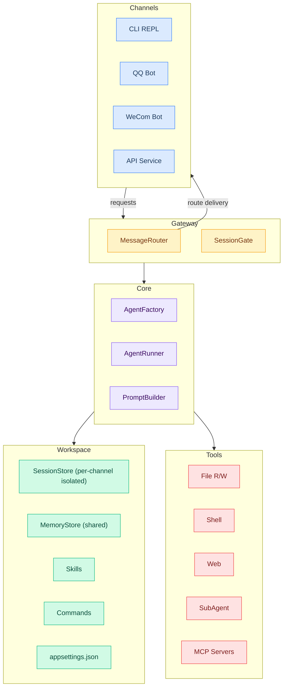

<div align="center">

[](https://deepwiki.com/AkiKurisu/DotBot)
[](https://www.zhihu.com/people/akikurisu)
[](https://space.bilibili.com/20472331)

**[中文](./README_ZH.md) | English**

# DotBot

**DotBot** (.Bot) is a lightweight OpenClaw for .Net that is secure, reliable, and ready to use out of the box.


</div>

## ✨ Features

<table>
<tr>
<td width="33%" align="center"><b>🪶 Lightweight & Minimal</b><br/>Written in C#，built on .NET 10, single-file, no complex dependencies.</td>
<td width="33%" align="center"><b>🚀 One-Click Deployment</b><br/>No complicated configuration process required.</td>
<td width="33%" align="center"><b>🔒 Secure Approval</b><br/>Multi-layer security with approval flow for high-risk operations.</td>
</tr>
</table>

- 🛠️ **Tool Capabilities**: File read/write (workspace-scoped), controlled Shell commands, Web scraping, optional SubAgent delegation
- 🔌 **MCP Integration**: Connect external tool services via [Model Context Protocol](https://modelcontextprotocol.io/)
- 🎮 **Multiple Runtime Modes**: Local REPL, QQ Bot (OneBot V11), WeCom Bot, API Service (OpenAI-compatible), **Gateway multi-channel concurrent mode**
- 📊 **Dashboard**: Built-in Web UI for real-time monitoring of token usage, session history, and tool call traces
- 🧩 **Skills System**: Dynamically load Skills from workspace
- 📢 **Notification Push**: WeCom group bot and Webhook notifications


<div align="center">QQ bot mode</div>


<div align="center">CLI mode</div>


<div align="center">In API mode, you can use ChatBox to communicate with DotBot</div>


<div align="center">Dashboard monitors usage and session history</div>

## 🏗️ Architecture



## 🧬 Design

### Session Isolation Between Channels

Each channel derives its own session ID so conversations never collide:

- **QQ**: `qq_{groupId}` (group chat) or `qq_{userId}` (private chat)
- **WeCom**: `wecom_{chatId}_{userId}`
- **API**: resolved from `X-Session-Key` header, `user` field in body, or content fingerprint

`SessionGate` provides per-session mutual exclusion — concurrent requests to the same session are serialized, while different sessions run fully in parallel. `MaxSessionQueueSize` controls how many requests can queue per session before the oldest is evicted.

### Shared Workspace & Memory

All channels running in Gateway mode share the **same workspace**:

- **MemoryStore**: `memory/MEMORY.md` (structured long-term facts, always in context) + `memory/HISTORY.md` (append-only grep-searchable event log)
- **File tools, Shell commands, Skills, and Commands** all operate within the same workspace directory
- Knowledge learned through one channel (e.g., a QQ group conversation) is accessible from any other channel (e.g., WeCom)

### Multi-Workspace Support

DotBot uses a **two-level configuration** model:

| Level | Path | Purpose |
|-------|------|---------|
| Global | `~/.bot/appsettings.json` | API keys, default model, shared settings |
| Workspace | `<workspace>/.bot/appsettings.json` | Per-project overrides, channel config, MCP servers |

Each workspace is a fully independent working directory with its own `.bot/` folder containing sessions, memory, skills, commands, and configuration. Run multiple DotBot instances pointed at different workspace directories for complete isolation.

## 🚀 Quick Start

### Prerequisites

- [.NET 10 SDK](https://dotnet.microsoft.com/download) (only required for building)
- Supported LLM API Key (OpenAI-compatible format)

### Build & Install

```bash
# Build the Release package
build.bat

# Configure the path to environment variables (optional)
cd Release/DotBot
powershell -File install_to_path.ps1
```

### Configuration

DotBot uses a two-level configuration: **Global config** (`~/.bot/appsettings.json`) and **Workspace config** (`<workspace>/.bot/appsettings.json`).

For first-time use, create the global config file:

```json
{
    "ApiKey": "sk-your-api-key",
    "Model": "gpt-4o-mini",
    "EndPoint": "https://api.openai.com/v1"
}
```

> 💡 Storing API Key in global config prevents it from leaking into workspace Git repositories.

### Launch

```bash
# Enter the workspace
cd Workspace

# Start DotBot (CLI mode)
dotbot
```

### Enable Runtime Modes

| Mode | Enable Condition | Usage |
|------|------------------|-------|
| CLI Mode | Default | Local REPL interaction |
| API Mode | `Api.Enabled = true` | OpenAI-compatible HTTP service |
| QQ Bot | `QQBot.Enabled = true` | OneBot V11 protocol bot |
| WeCom Bot | `WeComBot.Enabled = true` | WeChat Work bot |

### Customizing with Bootstrap Files

Place any of these files in `.bot/` to inject instructions into the agent's system prompt:

| File | Purpose |
|------|---------|
| `AGENTS.md` | Project-specific agent behavior and conventions |
| `SOUL.md` | Personality and tone guidelines |
| `USER.md` | Information about the user |
| `TOOLS.md` | Tool usage instructions and preferences |
| `IDENTITY.md` | Custom identity override |

**Example** — `.bot/AGENTS.md`:

```markdown
# Project Conventions

- This is a C# .NET 10 project using minimal APIs
- Always run `dotnet test` before committing
- Follow the existing code style: file-scoped namespaces, primary constructors
- Use Chinese for user-facing messages, English for code comments
```

### Custom Command Example

Custom commands are markdown files in `.bot/commands/`. Users invoke them with `/command-name [args]`.

**Example**:

```markdown
---
description: Test subagent functionality by creating, listing, and verifying a file
---

Please test the subagent feature. Spawn a subagent to complete the following tasks:
1. Create a test file `test_subagent_result.txt` in the workspace with content "Hello from Subagent! Time: " followed by the current time
2. List the workspace root directory files to confirm the file was created
3. Read the created file and verify the content is correct

Report the subagent execution result when done.

$ARGUMENTS
```

Invoke it with: `/test-subagent`

Placeholders: `$ARGUMENTS` expands to the full argument string, `$1`, `$2`, etc. expand to positional arguments.

## 📚 Documentation

| Document | Description |
|----------|-------------|
| [Configuration Guide](./Documentation/en/config_guide.md) | Tools, security, blacklists, approval, MCP, Gateway |
| [API Mode Guide](./Documentation/en/api_guide.md) | OpenAI-compatible API, tool filtering, SDK examples |
| [QQ Bot Guide](./Documentation/en/qq_bot_guide.md) | NapCat / permissions / approval |
| [WeCom Guide](./Documentation/en/wecom_guide.md) | WeCom push notifications / bot mode |
| [DashBoard Guide](./Documentation/en/dash_board_guide.md) | Built-in Web debugging UI, Trace data viewer |
| [Documentation Index](./Documentation/en/index.md) | Full documentation navigation |

## 🙏 Credits

Inspired by nanobot and built on the Microsoft Agent Framework, this project utilized multiple AI tools to complete all development work for the first release version within two weeks.

Google Nano Banana Pro generated the project's logo.

Thanks to [Devin AI](https://devin.ai/) for providing free ACU credits to facilitate development.

- [HKUDS/nanobot](https://github.com/HKUDS/nanobot)
- [microsoft/agent-framework](https://github.com/microsoft/agent-framework)
- [NapNeko/NapCatQQ](https://github.com/NapNeko/NapCatQQ)
- [spectreconsole/spectre.console](https://github.com/spectreconsole/spectre.console)
- [modelcontextprotocol/csharp-sdk](https://github.com/modelcontextprotocol/csharp-sdk)

## 📄 License

Apache License 2.0
