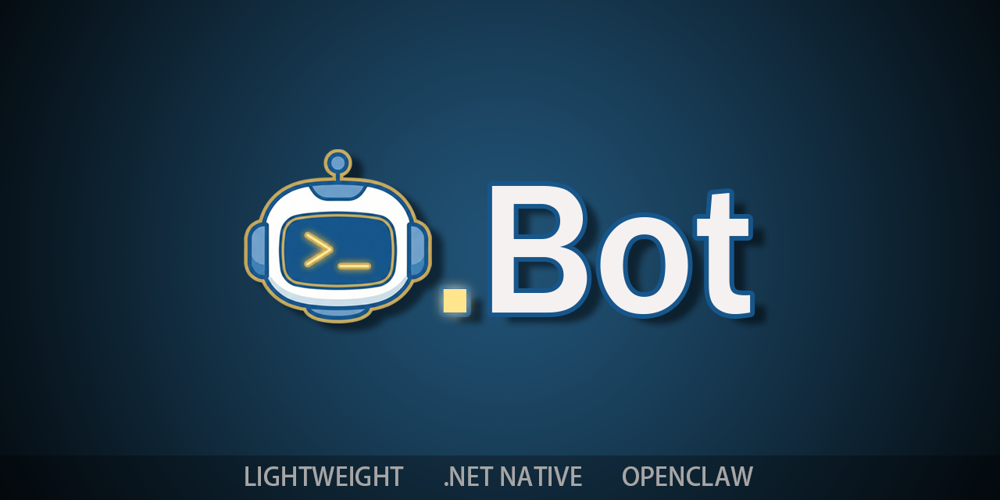
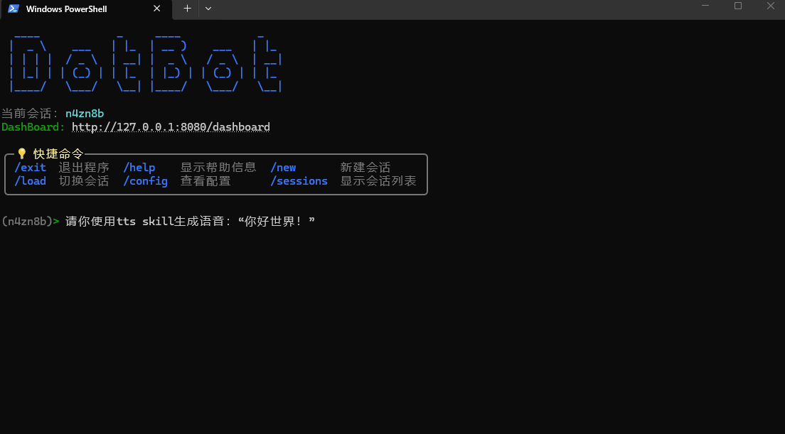
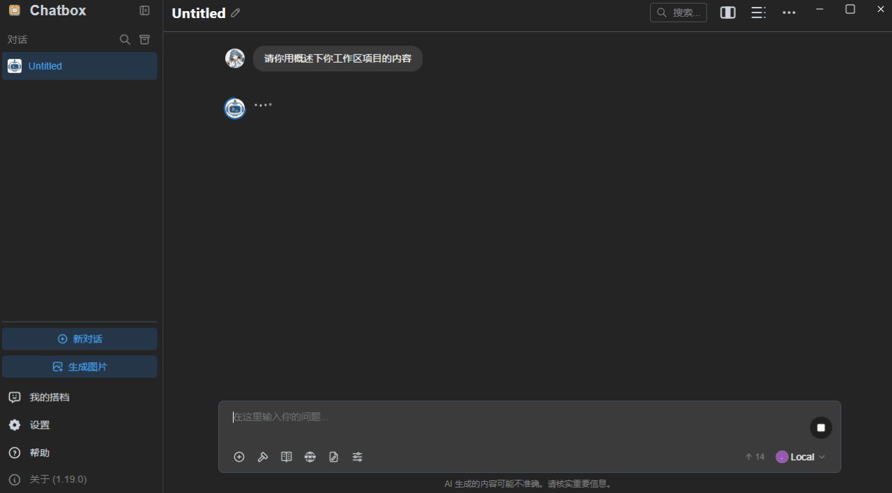
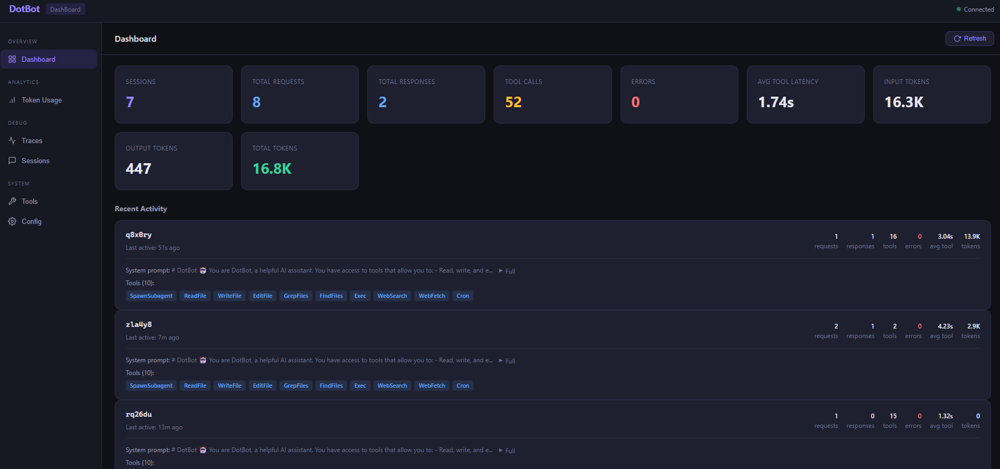
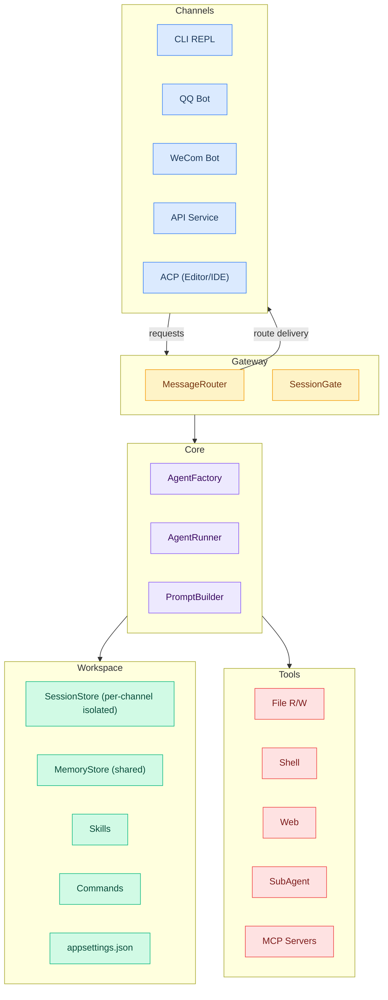

<div align="center">

[](https://deepwiki.com/AkiKurisu/DotBot)
[](https://www.zhihu.com/people/akikurisu)
[](https://space.bilibili.com/20472331)

**中文 | [English](./README.md)**

# DotBot

**DotBot** (.Bot) 是一个轻量级的 .Net 版 OpenClaw，安全可靠，开箱即用。



</div>

## ✨ 主要特性

<table>
<tr>
<td width="33%" align="center"><b>🪶 轻量极简</b><br/>C# 编写，基于 .NET 10 构建，单文件，无复杂依赖。</td>
<td width="33%" align="center"><b>🚀 一键部署</b><br/>无需复杂的配置流程。</td>
<td width="33%" align="center"><b>🔒 安全审批</b><br/>多层安全防护+审批流程，高危操作可控。</td>
</tr>
</table>

- 🛠️ **工具能力**: 文件读写（工作区内）、受控 Shell 命令、Web 抓取、可选子智能体（SubAgent）
- 🔌 **MCP 接入**: 支持通过 [Model Context Protocol](https://modelcontextprotocol.io/) 接入外部工具服务
- 🎯 **运行形态**: 本地 REPL、QQ 机器人（OneBot V11）、企业微信机器人、API 服务（OpenAI 兼容）、**ACP 编辑器集成**、**Gateway 多 Channel 并发模式**
- 📊 **监控面板**: 内置 Web 调试界面，实时监控 Token 使用、会话历史和工具调用追踪
- 🧩 **技能系统**: 支持动态加载技能
- 📢 **通知推送**: 企业微信群机器人和 Webhook 推送


<div align="center">QQ 机器人模式</div>



<div align="center">CLI 模式</div>



<div align="center">API 模式下可以使用 ChatBox 来和 DotBot 对话</div>



<div align="center">DashBoard 监控用量和会话历史</div>

## 🏗️ 架构



## 🧬 设计

### Channel 间的会话隔离

每个 Channel 派生独立的会话 ID，对话互不干扰：

- **QQ**：`qq_{groupId}`（群聊）或 `qq_{userId}`（私聊）
- **WeCom**：`wecom_{chatId}_{userId}`
- **API**：从请求头 `X-Session-Key`、Body 中的 `user` 字段或内容指纹中解析
- **ACP**：`acp_{sessionId}`（由编辑器管理）

`SessionGate` 对每个会话提供互斥保护——同一会话的并发请求将被串行化，不同会话则完全并行执行。`MaxSessionQueueSize` 控制每个会话的最大排队请求数，超出时最旧的请求将被丢弃。

### 共享工作区与记忆

在 Gateway 模式下，所有 Channel 共享**同一个工作区**：

- **MemoryStore**：`memory/MEMORY.md`（结构化长期记忆，始终在上下文中）+ `memory/HISTORY.md`（仅追加的可 grep 搜索的事件日志）
- **文件工具、Shell 命令、技能和命令**均在同一工作区目录下运行
- 通过某个 Channel（如 QQ 群）学到的知识，可在其他 Channel（如企业微信）中访问

### 多工作区支持

DotBot 采用**两级配置**模型：

| 级别 | 路径 | 用途 |
|------|------|------|
| 全局 | `~/.bot/appsettings.json` | API Key、默认模型、共享设置 |
| 工作区 | `<workspace>/.bot/appsettings.json` | 项目级覆盖、Channel 配置、MCP 服务器 |

每个工作区都是完全独立的工作目录，拥有自己的 `.bot/` 文件夹，包含会话、记忆、技能、命令和配置。将多个 DotBot 实例指向不同的工作区目录，即可实现完全隔离。

## 🚀 快速开始

### 环境要求

- [.NET 10 SDK](https://dotnet.microsoft.com/download)（仅构建时需要）
- 支持的 LLM API Key（OpenAI 兼容格式）

### 构建与安装

```bash
# 构建 Release 包
build.bat

# 配置路径到环境变量（可选）
cd Release/DotBot
powershell -File install_to_path.ps1
```

### 配置

DotBot 使用两级配置：**全局配置**（`~/.bot/appsettings.json`）和**工作区配置**（`<workspace>/.bot/appsettings.json`）。

首次使用，创建全局配置文件：

```json
{
    "ApiKey": "sk-your-api-key",
    "Model": "gpt-4o-mini",
    "EndPoint": "https://api.openai.com/v1"
}
```

> 💡 将 API Key 放在全局配置可避免泄露到工作区 Git 仓库。

### 启动

```bash
# 进入工作区
cd Workspace

# 启动 DotBot（CLI 模式）
dotbot
```

### 启用运行模式

| 模式 | 启用条件 | 用途 |
|------|----------|------|
| CLI 模式 | 默认 | 本地 REPL 交互 |
| API 模式 | `Api.Enabled = true` | OpenAI 兼容 HTTP 服务 |
| QQ 机器人 | `QQBot.Enabled = true` | OneBot V11 协议机器人 |
| 企业微信 | `WeComBot.Enabled = true` | 企业微信机器人 |
| ACP 模式 | `Acp.Enabled = true` | 编辑器/IDE 集成（[ACP](https://agentclientprotocol.com/)） |

### 使用 Bootstrap 文件进行自定义

将以下任意文件放入 `.bot/` 目录，即可将自定义指令注入到智能体的系统提示词中：

| 文件 | 用途 |
|------|------|
| `AGENTS.md` | 项目专属的智能体行为与规范 |
| `SOUL.md` | 个性风格与语气指南 |
| `USER.md` | 用户相关信息 |
| `TOOLS.md` | 工具使用说明与偏好 |
| `IDENTITY.md` | 自定义身份覆盖 |

**示例** — `.bot/AGENTS.md`：

```markdown
# Project Conventions

- This is a C# .NET 10 project using minimal APIs
- Always run `dotnet test` before committing
- Follow the existing code style: file-scoped namespaces, primary constructors
- Use Chinese for user-facing messages, English for code comments
```

### 自定义命令示例

自定义命令是存放在 `.bot/commands/` 目录中的 Markdown 文件，用户通过 `/命令名 [参数]` 的方式调用。

**示例**：

```markdown
---
description: Test subagent functionality by creating, listing, and verifying a file
---

Please test the subagent feature. Spawn a subagent to complete the following tasks:
1. Create a test file `test_subagent_result.txt` in the workspace with content "Hello from Subagent! Time: " followed by the current time
2. List the workspace root directory files to confirm the file was created
3. Read the created file and verify the content is correct

Report the subagent execution result when done.

$ARGUMENTS
```

调用方式：`/test-subagent`

占位符说明：`$ARGUMENTS` 展开为完整参数字符串，`$1`、`$2` 等依次展开为各位置参数。

## 📚 文档导航

| 文档 | 说明 |
|------|------|
| [配置指南](./Documentation/config_guide.md) | 工具、安全、黑名单、审批、MCP、Gateway |
| [API 模式指南](./Documentation/api_guide.md) | OpenAI 兼容 API、工具过滤、SDK 示例 |
| [QQ 机器人指南](./Documentation/qq_bot_guide.md) | NapCat/权限/审批 |
| [企业微信指南](./Documentation/wecom_guide.md) | 企业微信推送/机器人模式 |
| [ACP 模式指南](./Documentation/config_guide.md#acp-模式配置) | Agent Client Protocol 编辑器/IDE 集成 |
| [DashBoard 指南](./Documentation/dash_board_guide.md) | 内置 Web 调试界面、追踪数据查看器 |
| [文档索引](./Documentation/index.md) | 完整文档导航 |

## 🙏 致谢

本项目受 nanobot 启发，基于微软 Agent Framework 打造，使用多个 AI 工具在两周内完成第一个 Release 版本的所有开发内容。

谷歌 Nano Banana Pro 生成了本项目的 Logo。

感谢 [Devin AI](https://devin.ai/) 提供了免费的 ACU 额度为开发提供便捷。

- [HKUDS/nanobot](https://github.com/HKUDS/nanobot)
- [microsoft/agent-framework](https://github.com/microsoft/agent-framework)
- [NapNeko/NapCatQQ](https://github.com/NapNeko/NapCatQQ)
- [spectreconsole/spectre.console](https://github.com/spectreconsole/spectre.console)
- [modelcontextprotocol/csharp-sdk](https://github.com/modelcontextprotocol/csharp-sdk)
- [agentclientprotocol/agent-client-protocol](https://github.com/agentclientprotocol/agent-client-protocol)

## 📄 许可证

Apache License 2.0
